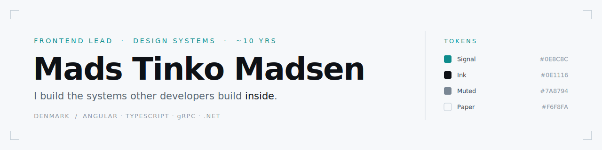

<picture>
  <source media="(prefers-color-scheme: dark)" srcset="assets/masthead-dark.svg">
  
</picture>

Frontend lead & design-focused engineer from Denmark. I architect the systems other developers build inside — component libraries, design tokens, and the visual craft — and I'm full-stack capable, with a backend half I can prove. Frontend is where I shine.

- Apprenticeship-trained (web-integrator + datatekniker, speciale i programmering), ~10 years building for the web
- Live portfolio → **[tinko.dk](https://tinko.dk)**

---

## What I focus on

- **Frontend architecture & design systems** — Angular, TypeScript, reusable component libraries, theming / design tokens
- **Design-minded engineering** — how an interface *feels*, not just that it works; layout, responsiveness, polish
- **Developer experience** — conventions, tooling and lint rules that keep a growing team's codebase honest

---

## What I'm building now

For 2+ years I've been the **Lead Frontend Developer** at **Engii-Soft**, building **EngiiCore** — an all-in-one, multi-tenant platform for consulting engineering & architecture firms (capacity planning, quote-to-cash, project economics, a built-in AI assistant). I rebuilt a stalled legacy app (frozen on Angular 12, ~10 major versions behind) into a modern **Angular 22** codebase — standalone components, signals, gRPC / Connect, MSAL auth — and set the conventions the team now builds inside. The foundations are mine:

- **Design system & theming** — the design-token foundation, themes and utility layer the whole app styles against, with hardcoded styles banned by lint. The team builds components on top of it; the system underneath is mine.
- **Generic component library** — the reuse pattern and the bulk of a ~30-component generic library: a typed config-driven table, tree / expandable tables, filter-bar, page-shell, cards, form-layout, a calendar subsystem.
- **gRPC / Connect layer** — `fetch` / `mutate` wrappers that centralize loading state and notifications, plus buf-based proto generation.
- **Route security** — the Angular guard wiring (permission / role / auth / bootstrap) that decides what each area gates.
- **Architecture-as-lint** — **26 custom ESLint rules** plus Husky pre-commit hooks that make the conventions self-enforce across the team.
- **Testing** — a 4-tier strategy including a novel **wire-compat** tier I built to catch protobuf wire drift on dependency bumps; I wrote most of the suite.
- **CI/CD & docs** — the GitHub Actions pipelines and the developer / architecture documentation the team onboards from.

I lead 2 developers, on a platform of hundreds of components across 30+ feature areas.

---

## Public code

The platform above is private, so here's public, clickable code that exercises the same muscles.

### [WiseWatt](https://github.com/MadsTinko/H6-WiseWatt-Frontend) — smart-home energy dashboard
My strongest public sample; it mirrors what I do professionally: **SSR**, **ECharts** dashboards, **JWT auth** (guard + interceptor + service), Angular **Material / CDK**, a custom **theming service**, and IoT-device CRUD across ~20 components and 7 services.

### [Texas Hold'em](https://github.com/MadsTinko/texas_holdem_app) — real-time multiplayer poker
A Flutter client over **SignalR** — live networking, game state, cross-platform UI. Its server is my [Poker Engine](https://github.com/MadsTinko/H4_Poker_Engine) below: I built both halves.

### [Scrumboard](https://github.com/MadsTinko/scrumboard) — Firebase-backed task board
A full CRUD scrum board wired to Firebase Realtime DB — auth, dialogs, typed models, live sync.

### [The Periodic Table](https://github.com/MadsTinko/ThePeriodicTable) — interactive Angular app
A clean interactive periodic table — data-mapper service, typed models, composable cell components.

**[tinko.dk](https://tinko.dk)** — my live, deployed portfolio.

---

## Where the architecture comes from — backend & CS foundations

The systems thinking I lead with on the frontend — generics, design tokens, reuse patterns — rests on real CS foundations. Here's the public proof that I understand the patterns I architect with, not just apply them.

### [Poker Engine](https://github.com/MadsTinko/H4_Poker_Engine) — real-time game server, front to back
A C# / ASP.NET **SignalR** server built on **factory patterns, interfaces and dependency injection**, with JWT auth, role management and a full **unit-test** suite — and it's the backend for my Flutter [Texas Hold'em](https://github.com/MadsTinko/texas_holdem_app) client. One real-time multiplayer system, both halves public.

**More that backs the architecture:**
- **SOLID & OOP in practice** — [SOLID geometry](https://github.com/MadsTinko/Geometri-SOLID), [generics](https://github.com/MadsTinko/GenericStarWars) and [class-based design](https://github.com/MadsTinko/ATM) — the same principles behind my generic component library.
- **Layered / clean architecture** — **EF Core** with a clean Data/Domain split ([StarWars EF Core](https://github.com/MadsTinko/StarWarsCharactersEFCore)) and relational modeling incl. many-to-many joins ([cocktails ORM](https://github.com/MadsTinko/H3_orm_cocktails)).
- **APIs & security** — an [ASP.NET Core Web API](https://github.com/MadsTinko/WhiteboardImagesAPI); [asymmetric](https://github.com/MadsTinko/H4_AsymmetricEncryption) encryption, [hashing & salting](https://github.com/MadsTinko/H4_Hashing_and_salting), [secure password storage](https://github.com/MadsTinko/SecurePasswords).
- **Shipped a complete app, end to end** — my [2017 web-integrator final exam](https://github.com/MadsTinko/Web-integrator-exam-assignment): an ASP.NET Web Forms webshop with a storefront, auth, SQL Server and a 7-page admin CMS. A dated stack now — which is the point: proof I've been shipping real products for the better part of a decade.
- **Professionally** — I spec backend work across the stack and own my platform's **gRPC / Connect** integration.

> WiseWatt was my **datatekniker final exam** (frontend + backend + IoT) — **graded 10** on the Danish scale.
---

## Foundations

These aren't hobby repos — the `H3`–`H6` prefixes are my **apprenticeship milestones**, worked through inside real companies. The deepest: I built a **working computer from NAND gates up** ([Nand2Tetris](https://github.com/MadsTinko/Nand2Tetris_Project1)) — gates → CPU → [assembler](https://github.com/MadsTinko/H5_Assembler) → VM → compiler — plus [data structures](https://github.com/MadsTinko/H5_DataStructure) & [sorting algorithms](https://github.com/MadsTinko/H5_Sorting_Algorithms) in C and [facial recognition](https://github.com/MadsTinko/facial_recognition) in C++.

---

## Also proud of

A **website-builder / CMS in Symfony (PHP)** built during an earlier apprenticeship — template-driven, dropdown-configured, Bootstrap, fully responsive, so a client could build and manage their entire site. Delivered **solo in ~6 months, learning PHP from scratch through the docs**. Predates this account — no repo, but one of the projects I'm proudest of, and a fair marker of my full-stack range.

---

## Tech I reach for

**Frontend** — Angular · TypeScript · Signals / RxJS · SCSS · Flutter / Dart

**Backend** — C# / .NET · ASP.NET · SignalR · EF Core · gRPC / Connect · Node · PHP / Symfony · SQL

**Practices** — design systems · patterns / SOLID · testing (Vitest · Playwright · Karma · xUnit) · CI/CD · custom lint tooling

Fourteen languages across the repos above and counting.

---

## Get in touch

